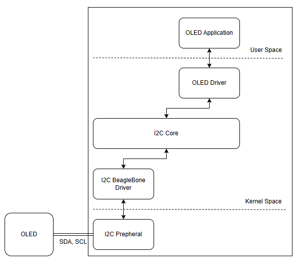
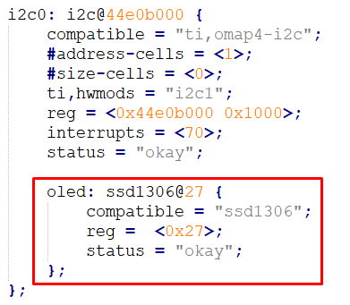
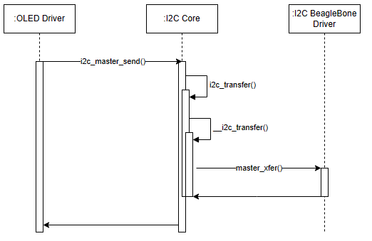

## Overview

1. Overview about SSD1306

[Link tham khảo](/Overview%20about%20SSD1306.pdf)

2. Overview about arch

3. Khởi tạo OLED device trong device tree

4. Sequence diagram 

## Steps
1. Xác định pins và bus I2C sử dụng
	+ Kiểm tra bus có được enable không? /sys/class/i2c-adapter/
	+ Kiểm tra pins có được map đúng với mode không: kiểm tra trong device tree

2. Xác định address của device 
	+ P1: Đọc datasheet với kiểm tra hw
	+ P2: i2cdetect -y -r <\bus>

3. Register device from device tree

4. Implement I2C driver

